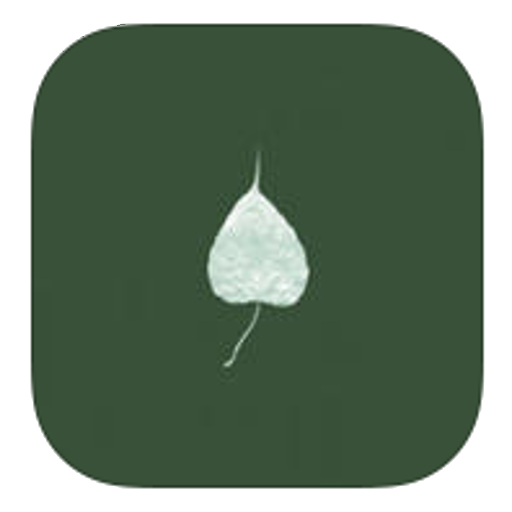
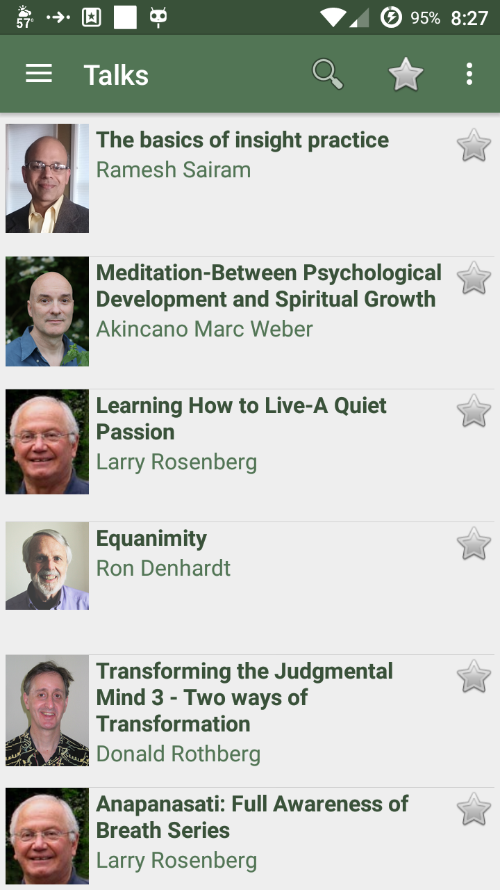
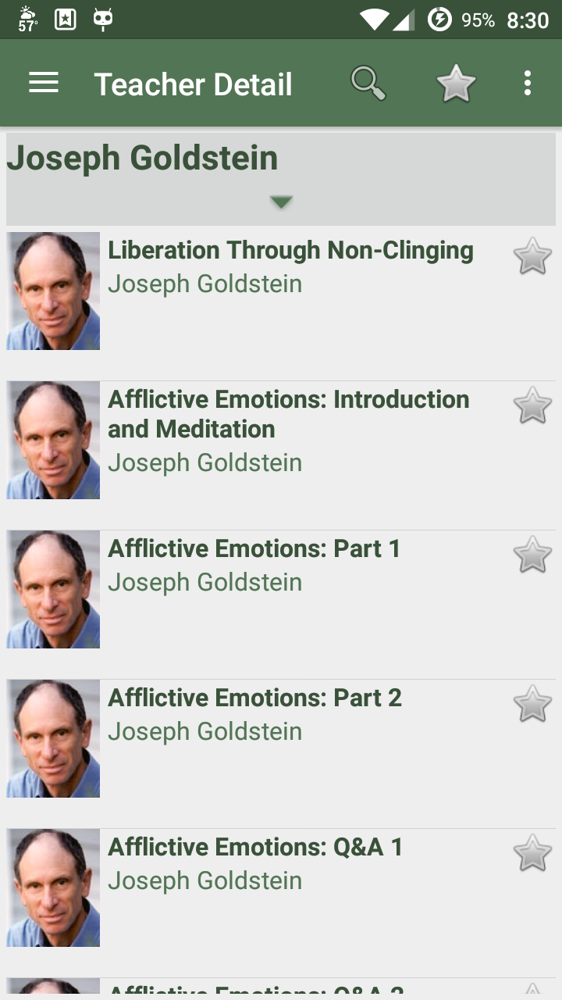
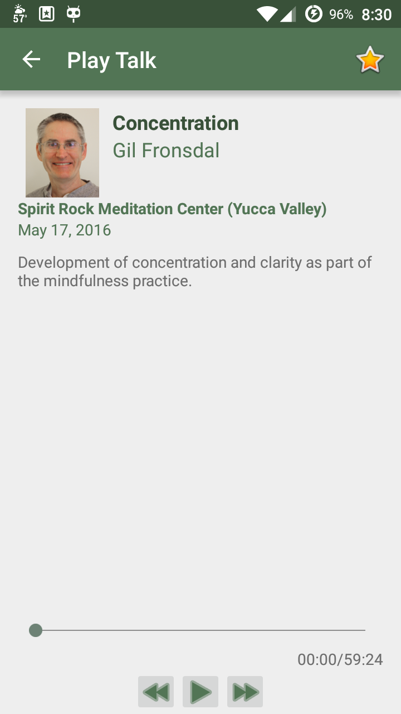

# Dharma Seed App for Android

Stream dharma talks from the [Dharma Seed archive](http://www.dharmaseed.org/) to your Android device.

Dharma Seed is dedicated to preserving and sharing the spoken teachings of Theravada Buddhism in modern languages.

## Features

* Stream dharma talks
* Find the most recent talks
* Search talk titles and descriptions by keyword
* Find talks by specific teachers
* Search a teacher's talks by keyword
* View teacher information
* Download talks and listen without cellular or internet connectivity

## Screenshots

## Contributing

Fork the repo using Github and clone your fork locally. To run the project, plug in your device and click the green 'Play' button in
Android Studio. Once you're ready to start making changes, create a branch: `git ch -b <branch_name>`. Name it something related to the
changes you plan on working on, like `update-db`. Once you've made your changes, run the tests to make sure you didn't break
anything and then add and commit to git. Once you've made as many commits as you need, push them to Github and create a PR.

### Running the Tests

As of right now, all of our tests are Instrumentation Tests (as opposed to Unit Tests) which means that they require a device to run.
They are located in `app/src/androidTest/`. Make sure your device is plugged in (you can also use an emulator but it's _much_ slower), right click the package `org.dharmaseed.android (androidTest)` in the project window of Android Studio, and select `Run tests in org.dharmaseed.android (androidTest)`.

## Notes

* Access to retreatants only talks is not currently supported.

These talks are freely offered in the spirit of dana, or generosity. You may visit the Dharma Seed website if you would like to support our work. We are a small non-profit organization supported solely through donations and we deeply appreciate your help in making these priceless teachings available to all.

Operating since the early 1980's, Dharma Seed collects and distributes dharma talks by teachers transmitting the Vipassana or Insight practices of Theravada Buddhism, the oldest Buddhist tradition still actively pursued in the 21st century.

We hope you enjoy the app.

May all beings be happy.
